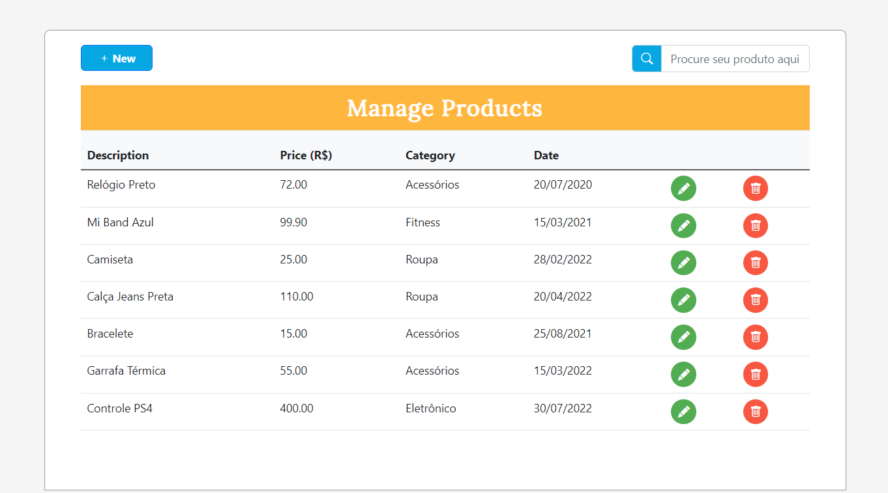
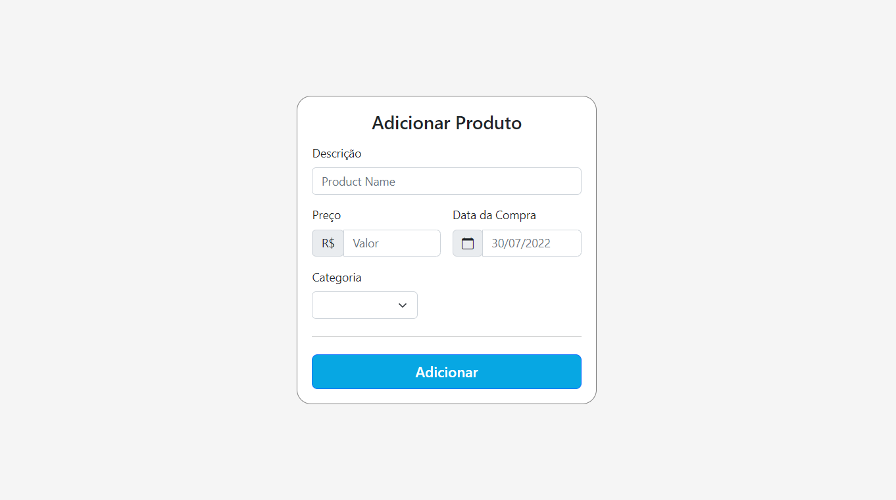
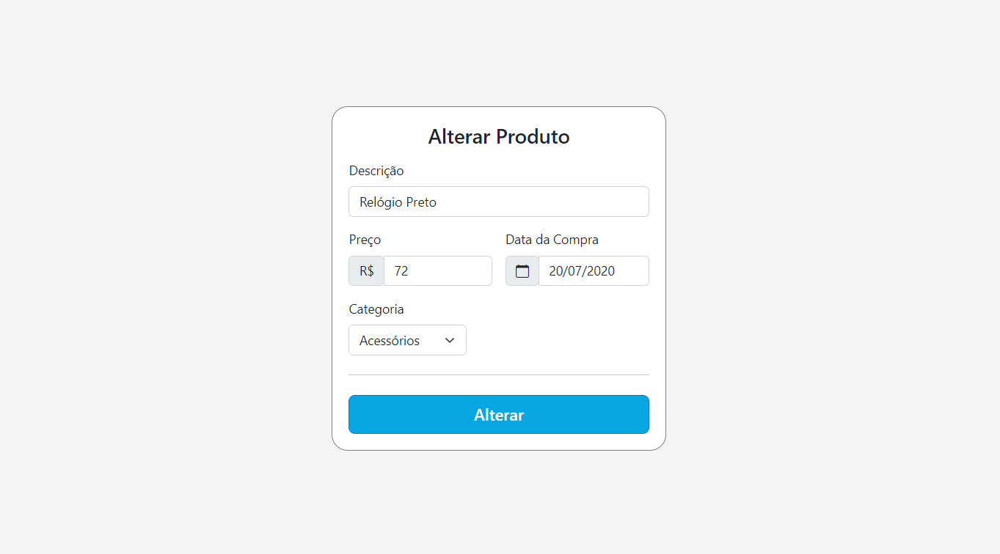
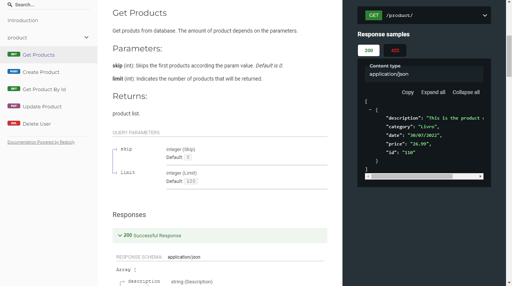
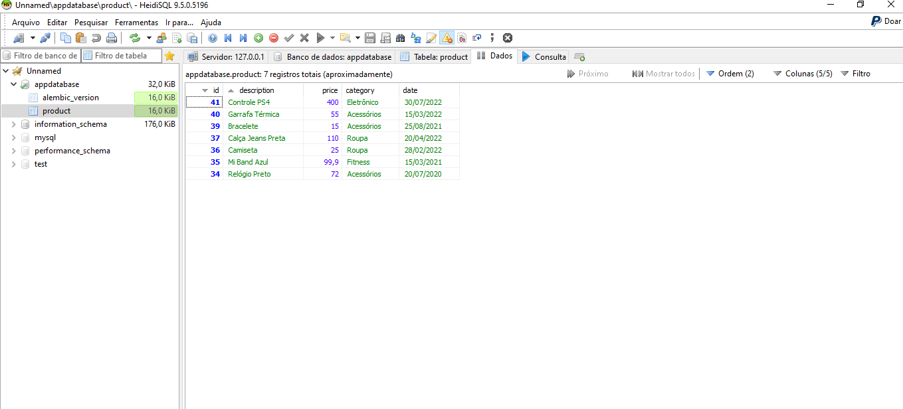

# productRegistration
Allows you to perform a CRUD of products in the application

## About the project

This project aims to build a complete system that allows performming a CRUD of products in the application.
For this, the following technologies were used:
- **Angular with Angular-CLI**
- **FastAPI()**
- **MariaDB**  - to store the information

To use all features of this app. You need to install the necessary dependencies. See more in [BackEnd Configuration](https://github.com/sgabriel-santos/productRegistration/tree/main/api#backend) and [FrontEnd Configuration](https://github.com/sgabriel-santos/productRegistration/tree/main/frontend#frontend)

## Results

#### Product Table

#### Page to Add or Update Product

When a product is selected. This page is showed with all fields filled

#### BackEnd

#### Database

