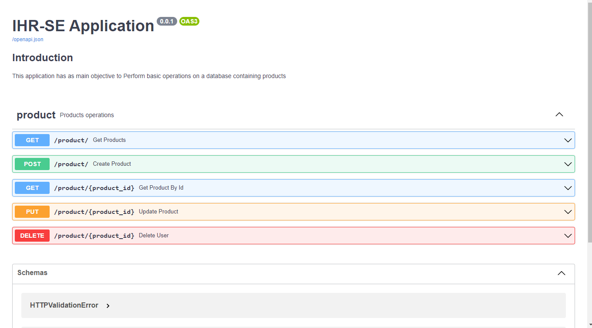
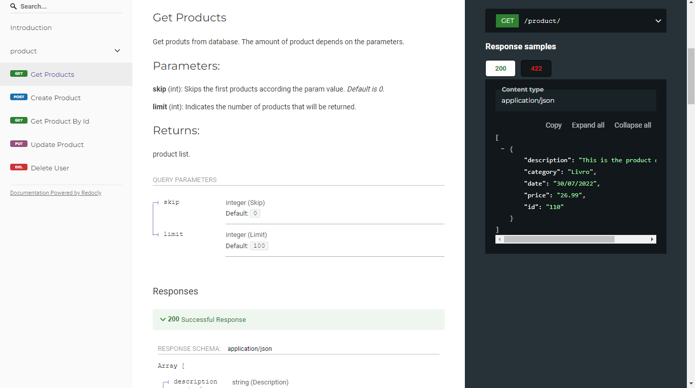

# Backend
To test the backend, follow the steps bellow:

## 1. Project Configuration

### 1.1 Installing project dependencies
- Open cmd in the `productRegistration\api` directory
- Create a python virtual enviroment with: `py -m venv venv`
- Open the virtual enviroment with: `venv\Scripts\activate` (on Windows)
- Install the project dependencies with: `pip install -r requirements.txt`

```sh
py -m venv venv
venv\Scripts\activate
pip install -r requirements.txt
```

After that, the project is successfully configured
But, It's necessary to configure database as in the next section


### 1.2 DataBase Configuration
- Install [MariaDB](https://mariadb.org/download/?t=mariadb&o=true&p=mariadb&r=10.3.13&os=windows&cpu=x86&pkg=msi)
- Configure new database in the root with the name appdatabase
- Or, If you prefer, update the information on [configDB](https://github.com/sgabriel-santos/productRegistration/blob/main/api/src/config/ConfigDB.py) file and 
  alembic.ini (sqlalchemy.url) files for your database
- You don't need create the tables, just the database. More, in the next section

#### 1.2.2 To create database tables it's necessary perform the bellow command
- Open cmd in `the productRegistration\api` directory again
- perform `alembic upgrade head` command 
- For more information about alembic, see the section [2.1 About Alembic](https://github.com/sgabriel-santos/productRegistration/tree/main/api#21-about-alembic)

```sh
alembic upgrade head
```


### 1.3 Using FastAPI() to test backend application

To test correctly:
- Open cmd in the `productRegistration\api` directory again
- perform this command: `uvicorn src.api:app --reload`
- The server will open on http://127.0.0.1:8000
- Open your browser at http://127.0.0.1:8000/docs
- Then, you can create, read, update or delete products (Be happy!)

```sh
uvicorn src.api:app --reload
```

---
# 2. Clarification

## 2.1 About Alembic
- [Alembic](https://alembic.sqlalchemy.org/en/latest/tutorial.html) is a lightweight database migration tool for usage with the SQLAlchemy Database Toolkit for Python. 
- With this tool, we can add migrations on application

## 2.2 About Documentation

FastAPI() provides two types of documentation

### 2.2.1 Interactive Documentation

Go to http://127.0.0.1:8000/docs.
You will see the automatic interactive API documentation (provided by [Swagger UI](https://github.com/swagger-api/swagger-ui)):



### 2.2.2 Alternative Documentation

Go to http://127.0.0.1:8000/redoc.

You will see the alternative automatic documentation (provided by [ReDoc](https://github.com/Redocly/redoc)):


